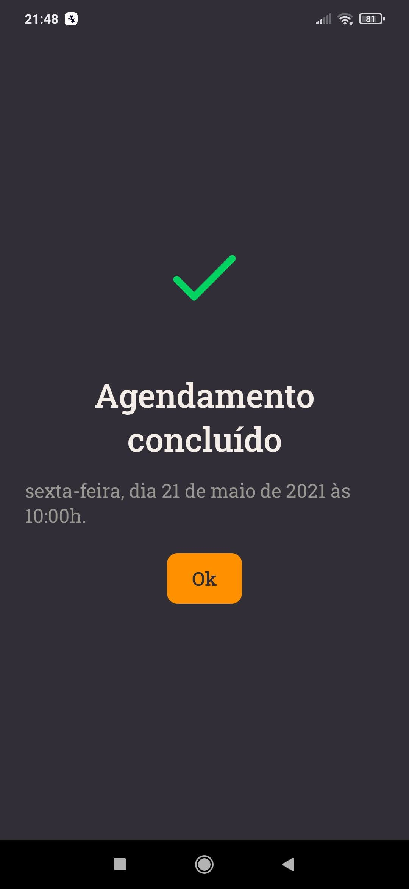

<p align="center" >
  
</p>

## 🔖 Sobre
GoBarber é uma plataforma web e mobile, que tem a função de conectar profissionais e clientes e, assim, facilitar os agendamentos de horário.

<br />

## 📷 Preview
<p align="center"> 
  
</p>

<p align="center">
  
  &nbsp
  
  &nbsp
  
  &nbsp
  
</p>

<br />

## 🛠 Tecnologias

- [Typescript](https://www.typescriptlang.org/)
- [Node.js](https://nodejs.org/en/) | [Express](https://expressjs.com/pt-br/)
- [React](https://reactjs.org/) | [React Native](https://reactnative.dev/)
- [Docker](https://www.docker.com/)
- [PostgreSQL](https://www.postgresql.org/) | [Redis](https://redis.io/) | [MongoDB](https://www.mongodb.com/1) | [TypeORM](https://typeorm.io/)
- [JWT](https://jwt.io/) | [BCrycptjs](https://github.com/dcodeIO/bcrypt.js#readme)

\* Para mais detalhes, veja o <kbd>package.json</kbd> de cada diretório.

<br />

## 🗂 Como baixar e iniciar o projeto

### Docker

É importante ter o [Docker](https://www.docker.com/) instalado em sua máquina, para rodar a API corretamente.

```bash
$ docker run --name gostack_postgres -e POSTGRES_PASSWORD=docker -p 5432:5432 -d postgres
$ docker run --name mongodb -p 27017:27017 -d mongo
$ docker run --name redis -p 6379:6379 -d redis:alpine

# Após executar os comandos acima, verificar se as imagens estão rodando no terminal:
$ docker ps -a

# Caso as imagens estejam paradas/não aparecem no terminal, executar:
$ docker start [CONTAINER ID]
```

### API
```bash
# Entrar no diretorio **/backend** e instalar as dependencias:
$ npm install

# Ainda no mesmo local, rodar o comando:
$ npm run dev:server
```


### Web
```bash
# Entrar no diretorio **/web** e instalar as dependencias:
$ npm install

# Ainda no mesmo local, rodar o comando:
$ npm start
```

### Mobile

```bash
# Entrar no diretorio **/mobile** e instalar as dependencias:
$ npm install

# Ainda no mesmo local, rodar o comando:
$ npm start

# Escaneie o QR Code exibido na janela do navegador.
```
</br>

## 📝 Licença

Este projeto esta sobe a licença MIT. Veja a [LICENÇA](https://opensource.org/licenses/MIT) para saber mais.

Desenvolvido por [Carlos Eduardo](https://www.linkedin.com/in/carlos-eduardo-andrade-de-mattos-a060b1182/) 🤓
